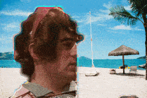
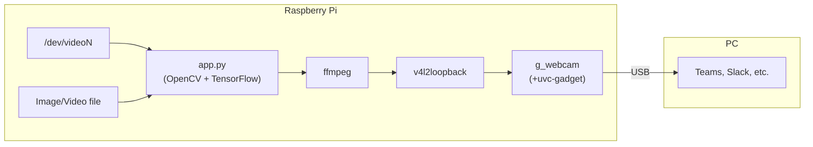

<p align="center">
  
</p>

# A "smart" USB webcam which hides your room well.

- Q. Why do you need this?
  - A. Because my man cave is too messy to have video meetings.
- Q. Why don't you use <SOFTWARE_NAME_HERE>  (e.g. Snap Camera)?
  - A. Because our IT dept. does not allow us to be root.
- Q. My IT dept. does not allow to use any unauthorized usb device.
  - A. Clean up your room.

Thanks to [[ajaichemmanam]'s great work](https://github.com/ajaichemmanam/simple_bodypix_python) on porting [tensorflow-js/body-pix](https://github.com/tensorflow/tfjs-models/tree/master/body-pix)
 ([Please see their jaw-dropping live demo if you miss it.](https://storage.googleapis.com/tfjs-models/demos/body-pix/index.html)) to Python, 
 an idea came to me that combining BodyPix and g_webcam to hide my messy room while working from home.

## Prerequisites
- Raspberry Pi 4 (Pi3 or other SBCs may work too.)
- USB Webcam (or RPi Camera Module)
- Jailed laptop provided by the IT dept.

## Data flow
[](https://mermaid-js.github.io/mermaid-live-editor/#/edit/eyJjb2RlIjoiZ3JhcGggTFJcbiAgICBzdWJncmFwaCBSYXNwYmVycnkgUGlcbiAgICAgICAgdmlkW1wiL2Rldi92aWRlb05cIl0gLS0-IGFwcFxuICAgICAgICBpbWdbSW1hZ2UvVmlkZW8gZmlsZV0gLS0-IGFwcFxuICAgICAgICBhcHBbXCJhcHAucHk8YnI-KE9wZW5DViArIFRlbnNvckZsb3cpXCJdIC0tPiBmZm1wZWdcbiAgICAgICAgZmZtcGVnW2ZmbXBlZ10gLS0-IHY0bDJsXG4gICAgICAgIHY0bDJsW3Y0bDJsb29wYmFja10gLS0-IGd3W1wiZ193ZWJjYW0gPGJyLz4oK3V2Yy1nYWRnZXQpXCJdXG4gICAgZW5kXG4gICAgc3ViZ3JhcGggUENcbiAgICAgICAgZ3cgLS0-IHxVU0J8c3dbVGVhbXMsIFNsYWNrLCBldGMuXVxuICAgIGVuZFxuIiwibWVybWFpZCI6eyJ0aGVtZSI6ImRlZmF1bHQifSwidXBkYXRlRWRpdG9yIjpmYWxzZX0)


## Setup steps
### Download models
```bash
$ cd path/to/cloned/repo
$ pipenv install 
$ pipenv run ./get-model.sh mobilenet/float/050/model-stride16
$ ls -hl posenet_mobilenet_float_050_model-stride16.pb
```
- See https://storage.googleapis.com/tfjs-models for other models

### Test run on your laptop
```bash
# Show the usage help
$ pipenv run start -h 
# Start app.py with -g to show results visually
$ pipenv run start -m posenet_mobilenet_float_050_model-stride16.pb -g

# Tips 1: Change the background image
$ pipenv run start -m posenet_mobilenet_float_050_model-stride16.pb -g -i awesome_image.jpg
# Tips 2: Change the background video
$ pipenv run start -m posenet_mobilenet_float_050_model-stride16.pb -g -e awesome_video.mp4
```

## Install to RPi
- Copy all the files including models to RPi.
```bash
$ rsync -avP ../rpi-wfh-webcam rpi4:/home/pi/
```

- To install TensorFlow on your Pi4, refer to https://qengineering.eu/install-tensorflow-2.1.0-on-raspberry-pi-4.html .
```bash
# Install the dependencies
$ sudo pip3 install opencv-python pillow
$ sudo apt install v4l2loopback-dkms v4l2loopback-utils ffmpeg

# Enable the required modules & overlay
$ sudo vi /boot/config.txt
dtoverlay=dwc2 # Append to the last line

$ sudo vi /etc/rc.local
modprobe v4l2loopback
modprobe dwc2
modprobe uvcvideo
sleep 3 # FIXME: Ugly hack to avoid crashes
modprobe g_webcam

# Reboot the device
$ sudo reboot now

# Check the mappings of video devices
$ v4l2-ctl --list-devices                                             
fe980000.usb (gadget):
        /dev/video3

bcm2835-codec-decode (platform:bcm2835-codec):
        /dev/video10
        /dev/video11
        /dev/video12

Dummy video device (0x0000) (platform:v4l2loopback-000):
        /dev/video0

USB 2.0 Camera: HD USB Camera (usb-0000:01:00.0-1.4):
        /dev/video1
        /dev/video2

# Lanch app.py and pipe the video stream to /dev/video0 by using ffmpeg.
# Also we use ffmpeg to resize the stream to 1280x720.
./app.py -m posenet_mobilenet_float_050_model-stride16.pb -c 1 |  ffmpeg -s 640x480 -f rawvideo -pix_fmt bgr24 -framerate 10 -i - -s 1280x720 -vf crop=w=640:h=360 -r 10 -f v4l2 -vcodec rawvideo -pix_fmt yuyv422 /dev/video0

# Then enable the webcam
./uvc-gadget.armv7 -f 0 -r 1 -u /dev/video3 -v /dev/video0
```
- On your laptop. Visit [WebRTC samples](https://webrtc.github.io/samples/src/content/getusermedia/resolution/) to check the video stream works.

## TODO
- [ ] Make a docker image for easier installation.
- [ ] Support .tflite to use Google Coral accelerator.
- [ ] It might be possible to override `getUserMedia()` to inject a processed video stream? (Oh, we don't need any Pi.)

## Acknowledgements
- [`bg.jpg`](./bg.jpg): Photo by Elizeu Dias on Unsplash
- tensorflow/tfjs-models: https://github.com/tensorflow/tfjs-models/tree/master/body-pix
- [wlhe]'s `uvc-gadget`: https://github.com/wlhe/uvc-gadget
- [ajaichemmanam]'s `simple_bodypix_python`: https://github.com/ajaichemmanam/simple_bodypix_python